# Financial Application - Layered Architecture (Mermaid)

```mermaid
graph TB
    %% Define styles
    classDef frontend fill:#E3F2FD,stroke:#1976D2,stroke-width:2px
    classDef backend fill:#FFF3E0,stroke:#F57C00,stroke-width:2px
    classDef data fill:#F3E5F5,stroke:#7B1FA2,stroke-width:2px
    classDef external fill:#E8F5E8,stroke:#388E3C,stroke-width:2px

    %% Frontend Layer
    subgraph Frontend ["🖥️ PRESENTATION LAYER (Frontend)"]
        LoginUI["Login with<br/>Google UI"]
        DashboardUI["Dashboard<br/>UI"]
        ChatUI["Chat with AI<br/>UI"]
        GoalsUI["Financial Goals<br/>UI"]
        ExportUI["Export Data<br/>UI"]
        NetWorthUI["Net Worth<br/>Visualizer"]
        SimulationUI["Simulations<br/>UI"]
        AlertsUI["Alerts & Nudges<br/>UI"]
    end

    %% Backend Layer
    subgraph Backend ["⚙️ APPLICATION LAYER (Backend)"]
        AuthService["Authentication<br/>Service"]
        DashService["Dashboard<br/>Service"]
        ChatService["AI Chat<br/>Service"]
        GoalsService["Financial Goals<br/>Service"]
        ExportService["Data Export<br/>Service"]
        NetWorthCalc["Net Worth<br/>Calculator"]
        SimEngine["Simulation<br/>Engine"]
        NotifyService["Notification<br/>Service"]
        InsightsGen["Insights<br/>Generator"]
    end

    %% Data Layer
    subgraph DataLayer ["🗄️ DATA LAYER (Database)"]
        UserRepo["User Data<br/>Repository"]
        FinAccounts["Financial<br/>Accounts"]
        Portfolio["Investment<br/>Portfolio"]
        Goals["Goals &<br/>Preferences"]
        Transactions["Transaction<br/>History"]
        ChatHistory["AI Chat<br/>History"]
    end

    %% External Services
    subgraph External ["🌐 EXTERNAL SERVICES (Third Party)"]
        GoogleOAuth["Google OAuth<br/>Service"]
        FinData["Financial<br/>Data Providers"]
        AIModels["AI/ML<br/>Models"]
        CreditScore["Credit Score<br/>Services"]
        MarketData["Market Data<br/>Providers"]
    end

    %% Frontend to Backend connections
    LoginUI --> AuthService
    DashboardUI --> DashService
    ChatUI --> ChatService
    GoalsUI --> GoalsService
    ExportUI --> ExportService
    NetWorthUI --> NetWorthCalc
    SimulationUI --> SimEngine
    AlertsUI --> NotifyService

    %% Backend to Data connections
    AuthService --> UserRepo
    DashService --> FinAccounts
    DashService --> Portfolio
    ChatService --> ChatHistory
    GoalsService --> Goals
    ExportService --> Transactions
    NetWorthCalc --> FinAccounts
    NetWorthCalc --> Portfolio
    SimEngine --> Portfolio
    NotifyService --> Goals
    InsightsGen --> Transactions

    %% Backend to External connections
    AuthService --> GoogleOAuth
    DashService --> FinData
    ChatService --> AIModels
    NetWorthCalc --> CreditScore
    SimEngine --> MarketData

    %% Apply styles
    class LoginUI,DashboardUI,ChatUI,GoalsUI,ExportUI,NetWorthUI,SimulationUI,AlertsUI frontend
    class AuthService,DashService,ChatService,GoalsService,ExportService,NetWorthCalc,SimEngine,NotifyService,InsightsGen backend
    class UserRepo,FinAccounts,Portfolio,Goals,Transactions,ChatHistory data
    class GoogleOAuth,FinData,AIModels,CreditScore,MarketData external
```

## Usage Instructions

1. **For Markdown documentation**: Copy the above Mermaid code block into any Markdown file
2. **For GitHub**: The diagram will render automatically in GitHub markdown files
3. **For other platforms**: Use [Mermaid Live Editor](https://mermaid.live/) to generate images

## Layer Descriptions

### 🖥️ Presentation Layer (Frontend)
- User interface components
- React/Vue/Angular applications
- Mobile app interfaces
- Web dashboards

### ⚙️ Application Layer (Backend)
- Business logic services
- API endpoints
- Microservices
- Processing engines

### 🗄️ Data Layer (Database)
- Data repositories
- Database storage
- Cache systems
- Data persistence

### 🌐 External Services (Third Party)
- OAuth providers
- External APIs
- SaaS integrations
- Third-party services