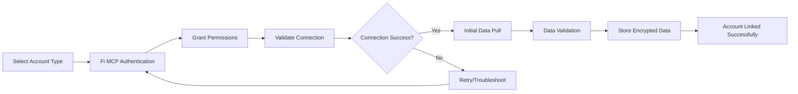
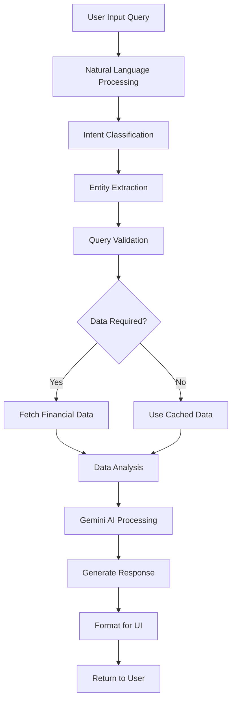
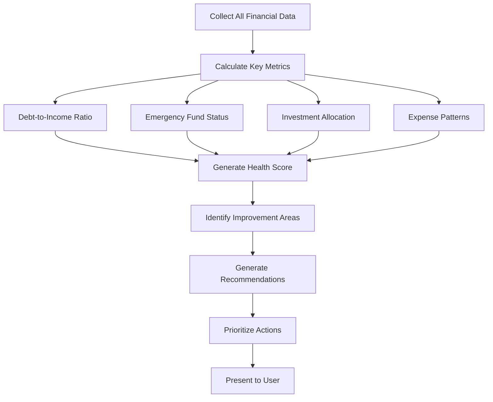
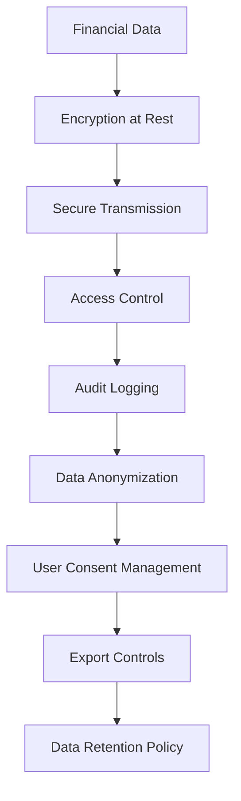

# Personal Finance AI Assistant - Process Flow Diagram

## Main User Journey Flow

```mermaid
flowchart TD
    A[User Starts App] --> B{First Time User?}
    
    B -->|Yes| C[Onboarding Process]
    B -->|No| D[Dashboard Landing]
    
    C --> C1[Account Setup]
    C1 --> C2[Connect Financial Accounts via Fi MCP]
    C2 --> C3[Data Sync & Validation]
    C3 --> C4[Initial Financial Health Analysis]
    C4 --> D
    
    D --> E[Main Dashboard View]
    E --> F[Choose Action]
    
    F --> G[Chat with AI Assistant]
    F --> H[View Financial Dashboard]
    F --> I[Set Goals & Projections]
    F --> J[Review Insights & Recommendations]
    F --> K[Export Data/Reports]
    
    %% Chat Flow
    G --> G1[Natural Language Query]
    G1 --> G2[Gemini AI Processing]
    G2 --> G3[Data Retrieval & Analysis]
    G3 --> G4[Conversational Response]
    G4 --> G5{More Questions?}
    G5 -->|Yes| G1
    G5 -->|No| F
    
    %% Dashboard Flow
    H --> H1[Net Worth Overview]
    H --> H2[Income vs Expenses]
    H --> H3[Investment Summary]
    H --> H4[Credit Score Status]
    H1 --> H5[Drill Down Details]
    H2 --> H5
    H3 --> H5
    H4 --> H5
    H5 --> F
    
    %% Goals & Projections Flow
    I --> I1[Create New Goal]
    I --> I2[View Existing Goals]
    I1 --> I3[Goal Parameters Input]
    I2 --> I4[Goal Progress Review]
    I3 --> I5[AI Simulation & Projection]
    I4 --> I6[Update Goal Parameters]
    I5 --> I7[Goal Tracking Setup]
    I6 --> I5
    I7 --> F
    
    %% Insights Flow
    J --> J1[Financial Health Score]
    J --> J2[Investment Recommendations]
    J --> J3[Debt Optimization]
    J --> J4[Budget Analysis]
    J1 --> J5[Detailed Breakdown]
    J2 --> J5
    J3 --> J5
    J4 --> J5
    J5 --> F
    
    %% Export Flow
    K --> K1[Choose Export Format]
    K1 --> K2[PDF Report]
    K1 --> K3[CSV Data]
    K1 --> K4[API Export]
    K2 --> K5[Generate & Download]
    K3 --> K5
    K4 --> K5
    K5 --> F
    
    %% Background Processes
    L[Scheduled Data Sync] --> L1[Fetch Latest Financial Data]
    L1 --> L2[Data Normalization]
    L2 --> L3[Update User Profiles]
    L3 --> L4[Generate New Insights]
    L4 --> L5[Send Notifications]
    
    M[Anomaly Detection] --> M1[Transaction Monitoring]
    M1 --> M2[Pattern Analysis]
    M2 --> M3{Anomaly Found?}
    M3 -->|Yes| M4[Alert User]
    M3 -->|No| M1
    M4 --> M1
    
    N[Financial Nudges] --> N1[Analyze User Behavior]
    N1 --> N2[Generate Personalized Nudges]
    N2 --> N3[Schedule Delivery]
    N3 --> N4[Send Nudge]
    N4 --> N1
```

## Detailed Sub-Process Flows

### 1. Account Linking Process

### 2. AI Query Processing

### 3. Financial Health Analysis

### 4. Goal Simulation Process

```mermaid
flowchart LR
    A[Goal Input] --> B[Current Financial State]
    B --> C[Define Parameters]
    C --> D[Monte Carlo Simulation]
    D --> E[Project Multiple Scenarios]
    E --> F[Calculate Probability]
    F --> G[Generate Timeline]
    G --> H[What-if Analysis]
    H --> I[Present Results]
    I --> J[Track Progress]
```

## Data Security & Privacy Flow
