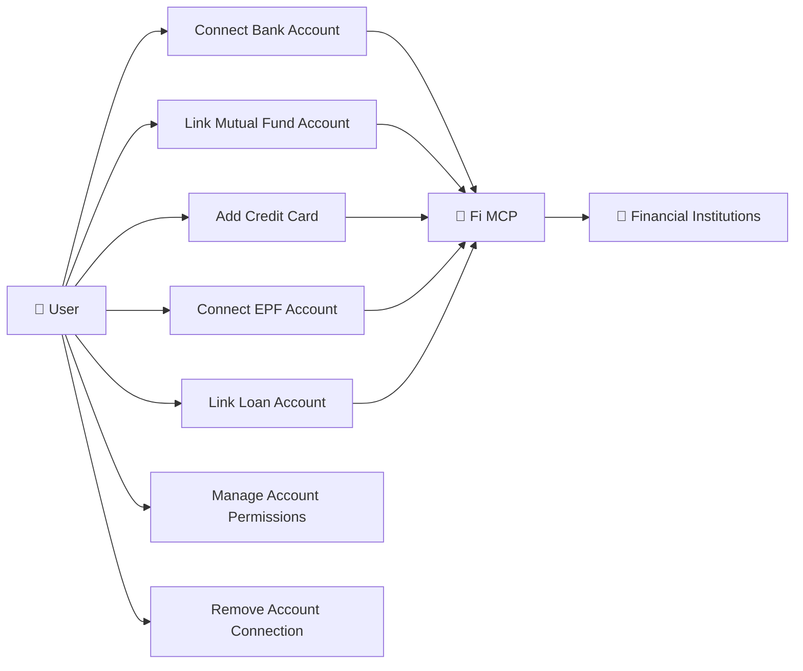
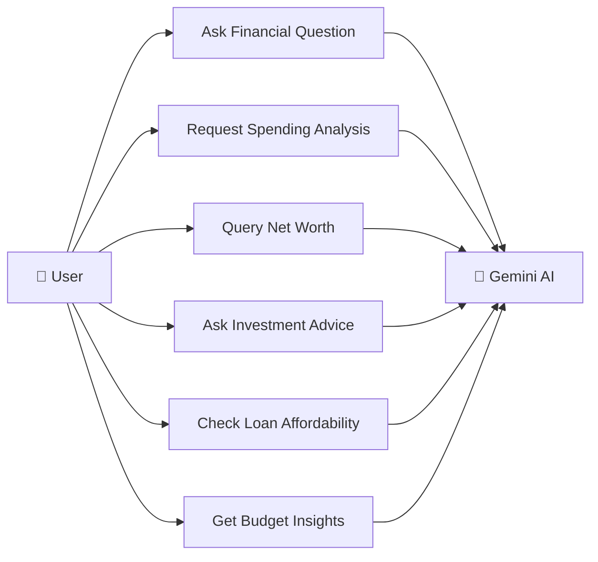
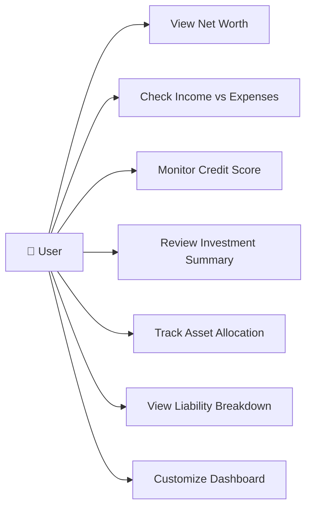
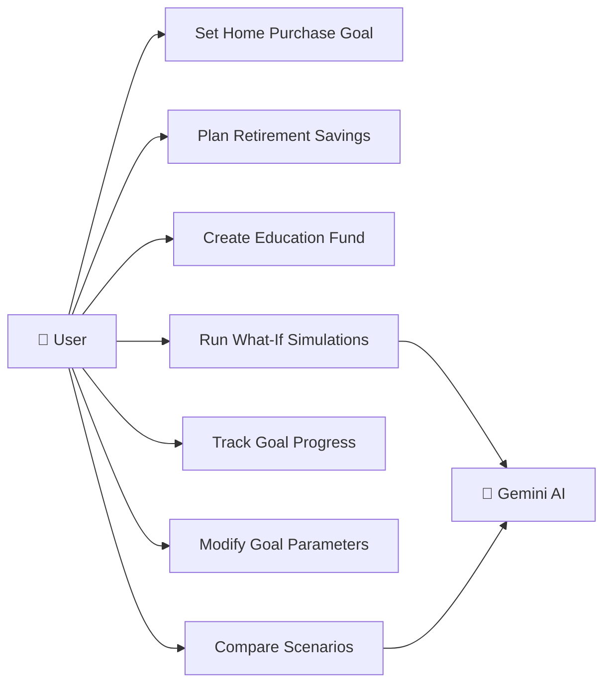
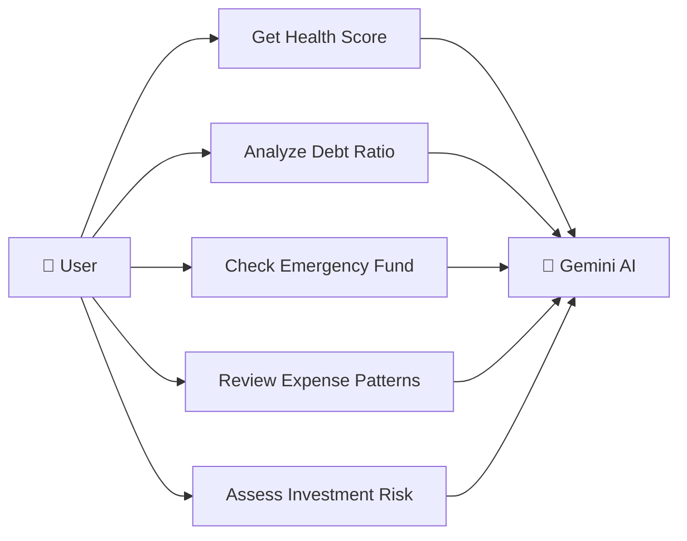
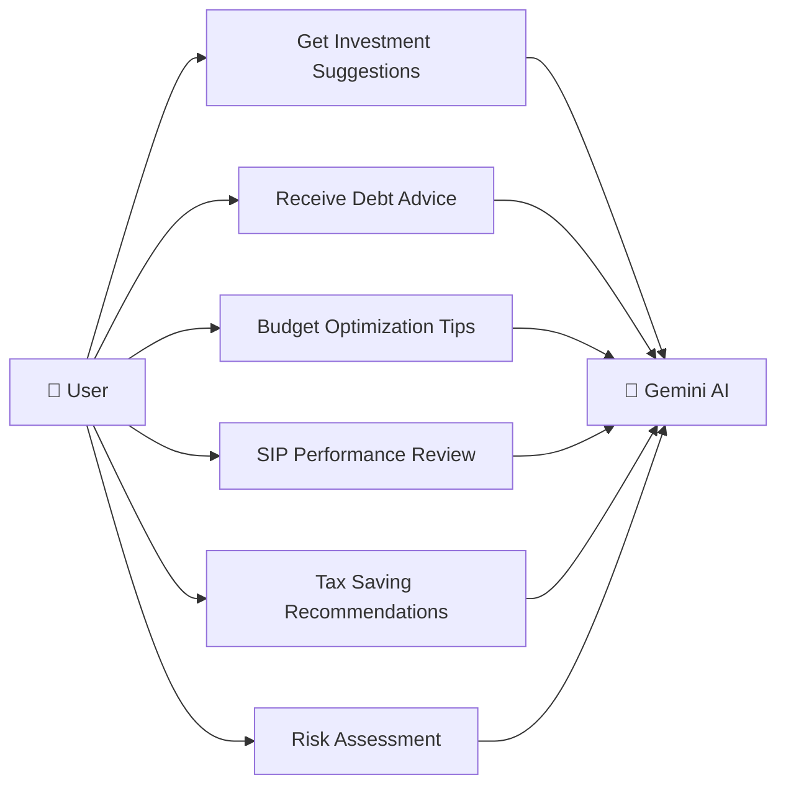
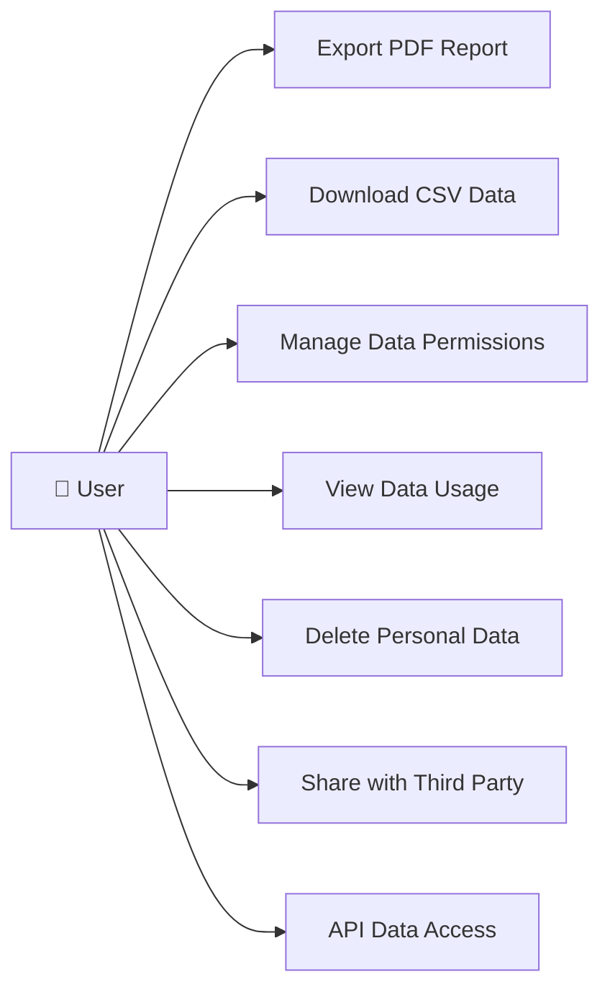
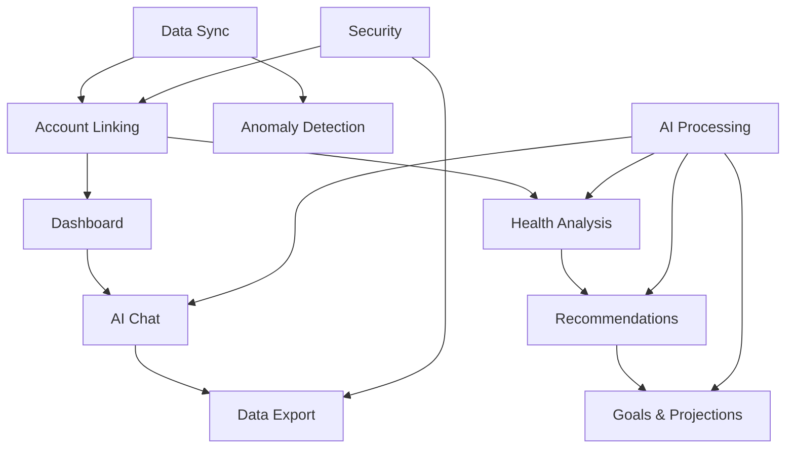

# Personal Finance AI Assistant - Use Case Diagram

## System Overview

```mermaid
graph TB
    subgraph "Personal Finance AI Assistant System"
        subgraph "Core MVP Features"
            UC1[Account Linking & Data Sync]
            UC2[Conversational AI Interface]
            UC3[Financial Dashboard]
            UC4[Goals & Projections]
            UC5[Financial Health Analysis]
            UC6[Insights & Recommendations]
            UC7[Data Export & Privacy]
        end
        
        subgraph "Advanced Features"
            UC8[Visual Analytics]
            UC9[Anomaly Detection]
            UC10[Financial Nudges]
        end
        
        subgraph "Background Services"
            UC11[Data Synchronization]
            UC12[AI Processing]
            UC13[Security Management]
        end
    end
    
    %% Actors
    User[👤 End User]
    Admin[👨‍💼 System Admin]
    FinInst[🏦 Financial Institutions]
    AIService[🤖 Gemini AI Service]
    MCPService[🔗 Fi MCP Service]
    
    %% User relationships
    User --> UC1
    User --> UC2
    User --> UC3
    User --> UC4
    User --> UC5
    User --> UC6
    User --> UC7
    User --> UC8
    User --> UC9
    User --> UC10
    
    %% Admin relationships
    Admin --> UC13
    Admin --> UC11
    
    %% External service relationships
    FinInst --> UC1
    AIService --> UC2
    AIService --> UC4
    AIService --> UC5
    AIService --> UC6
    MCPService --> UC1
    MCPService --> UC11
```

## Detailed Use Case Descriptions

### 1. Account Linking & Data Sync

### 2. Conversational AI Interface

### 3. Financial Dashboard

### 4. Goals & Projections

### 5. Financial Health Analysis

### 6. Insights & Recommendations

### 7. Data Privacy & Export

## Actor Definitions

### Primary Actors

**👤 End User (Primary Actor)**
- Individual seeking personal finance management
- Wants to understand financial health and make informed decisions
- Interacts with all core features of the system

**👨‍💼 System Administrator**
- Manages system configuration and security
- Monitors system performance and data integrity
- Handles user support and troubleshooting

### Secondary Actors

**🏦 Financial Institutions**
- Banks, mutual fund companies, credit card providers
- Provide financial data through APIs
- Maintain account information and transaction history

**🤖 Gemini AI Service**
- Google's AI service for natural language processing
- Generates insights and recommendations
- Processes complex financial queries

**🔗 Fi MCP (Model Context Protocol) Service**
- Secure data aggregation service
- Connects to multiple financial institutions
- Normalizes and standardizes financial data

## Use Case Priorities

### Core MVP (Must Have)
1. **Account Linking & Data Sync** - Foundation for all other features
2. **Conversational AI Interface** - Primary user interaction method
3. **Financial Dashboard** - Central information hub
4. **Goals & Projections** - Key value proposition
5. **Financial Health Analysis** - Core analytical feature
6. **Insights & Recommendations** - AI-driven value addition
7. **Data Privacy & Export** - Security and compliance

### Advanced Features (Should Have)
8. **Visual Analytics** - Enhanced user experience
9. **Anomaly Detection** - Proactive security
10. **Financial Nudges** - Behavioral improvement

### Supporting Services (Must Have for Operations)
11. **Data Synchronization** - Automated data updates
12. **AI Processing** - Backend intelligence
13. **Security Management** - System protection

## Key Use Case Relationships

